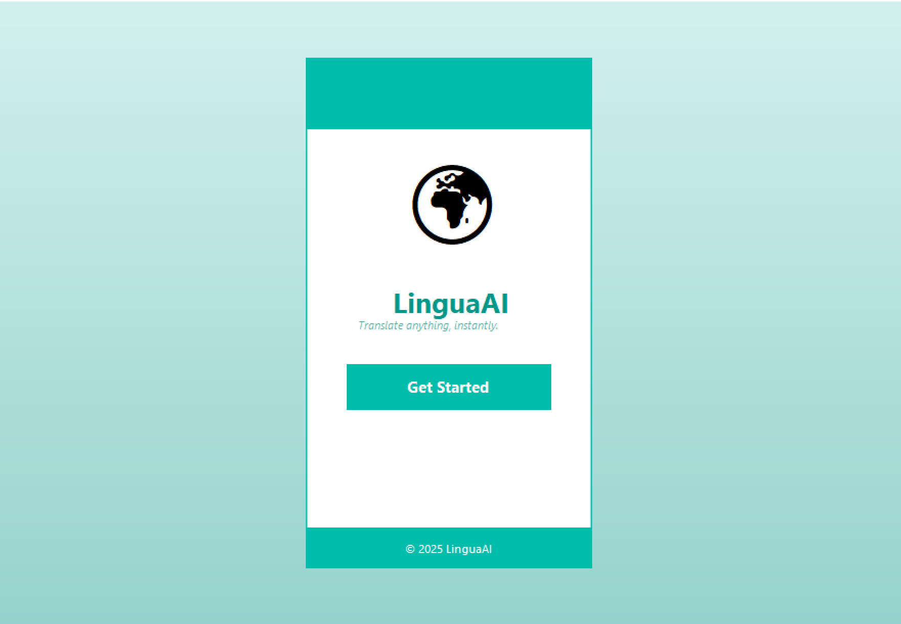
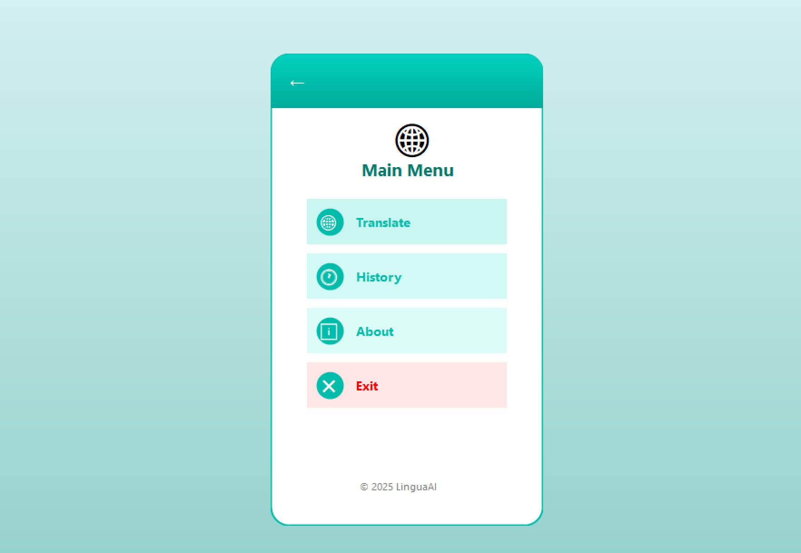
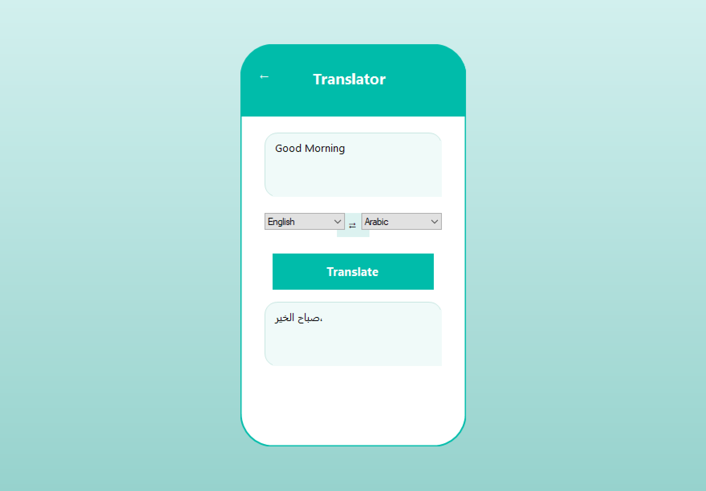
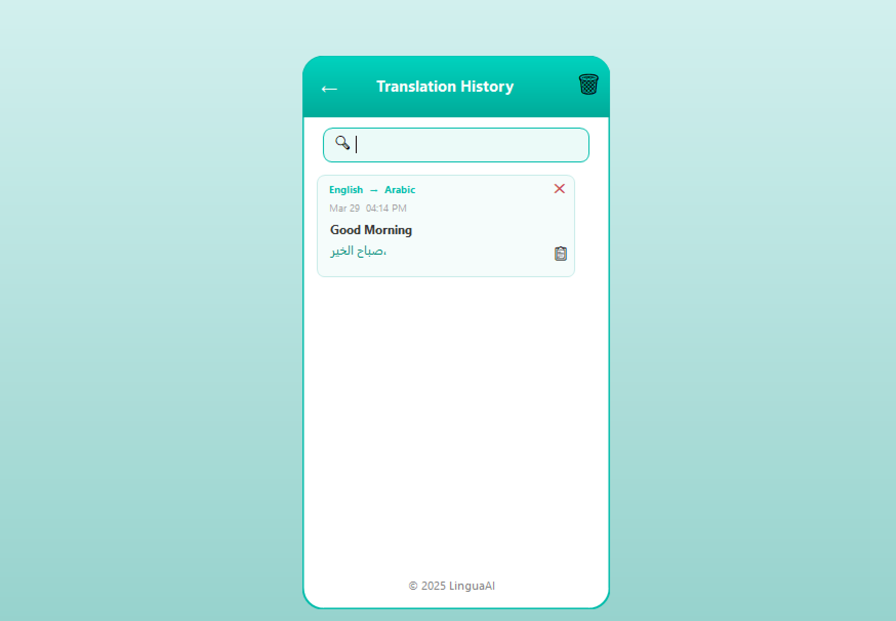
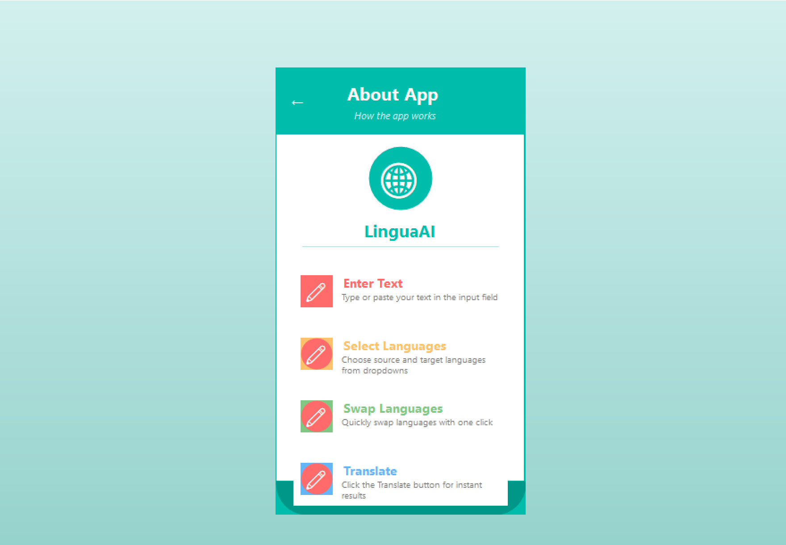

# 🌐 AI Language Translator

A .NET WinForms desktop application that translates text 
between multiple languages in real time using the 
MyMemory Translation REST API.

---

## 📌 Project Description

This application allows users to:
- Type any text in the input box
- Select a target language from the dropdown
- Click Translate to get instant translation
- View the translated text in the output box

The app uses the free MyMemory REST API which requires 
no API key and supports 30+ languages.

---

## 🛠️ Technologies Used

- C# | .NET WinForms
- MyMemory Translation REST API
- HttpClient for API calls
- JSON Parsing
- Docker
- Git & GitHub

---

## ⚙️ Setup Instructions

1. Clone the repository:
   git clone https://github.com/Samra-420/AI-Language-Translator

2. Open Visual Studio

3. Open the project file:
   AI-Language-Translator.sln

4. Build the project:
   Go to Build > Build Solution

5. Run the project:
   Press F5 or click Start

---

## 🌍 Supported Languages

- English
- Urdu
- French
- Spanish
- Arabic
- German
- Chinese

---

## 📸 Screenshots

### 🏠 Home Screen

### 📋 Menu

### 🔤 Translation

### 📜 History

### ℹ️ About

## 🐳 Docker Setup

1. Build the Docker image:
   docker build -t ai-language-translator .

2. Run the container:
   docker run ai-language-translator

---

## 👩‍💻 Developer

- **Name:** Samra Ramzan
- **Course:** Visual Programming Lab

---
## 📄 Reports

- 📘 [Theory Report](Samra_09_VP_Theory_assign1.pdf)
- 🔬 [Lab Report](Samra_09_VP_Lab_Language_Translator.pdf)

